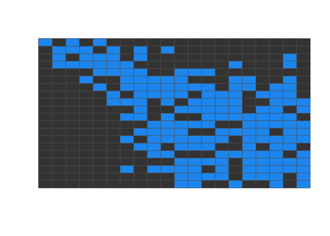
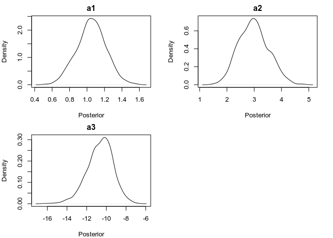
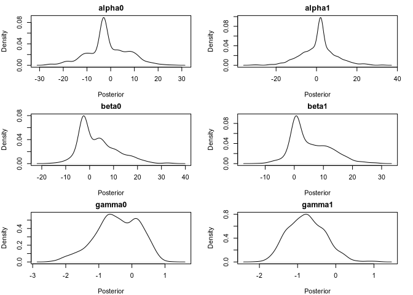

<!-- README.md is generated from README.Rmd. Please edit that file -->

# hattian

<!-- badges: start -->

<!-- badges: end -->

The goal of hattian is to model energy fluxes worldwide applying the
conceptual workflow from Antunes et al. (2024).

## Installation

You can install the development version of hattian from
[GitHub](https://github.com/) with:

``` r
devtools::install_github("emilio-berti/hattian")
```

hattian depends on big packages, such as stan and Rcpp, and it takes
some time to install. Be patient…

Load the package:

``` r
library(hattian)
```

# Datasets included in hattian

Hattian comes with \# datasets:

1.  `mammals`, the body mass (g) of mammals EltonTraits.
2.  `birds`, the body mass (g) of birds from EltonTraits.
3.  `amphibians`, the maximum body mass (g) of amphibians from AmphiBIO.
4.  `tetraeu`, the metweb of tetrapods of Europe.

From more details type `?<dataset>` in R, e.g. `?mammals`.

# Foodweb inference models

Hattian contains \# models to infer foodwebs:

1.  A scaling niche model, from Yeakel et al. (2014).
2.  A variable niche width model, from Li et al. (2023).

## Scaling niche model (Yeakel et al., 2014)

This is the simplest model implemented in hattian. The probability that
predator
 predates on prey
 is given by their body mass ratio:   
 = \\frac{p}{1 + p}
")  
where   
 + a_3 (log_{10}(\\frac{m_j}{m_i}))^2 )
")  
and
 and
 are the body masses if prey and predator, respectively.

This model is coded in stan and is called using `yeakel_stan()`:

``` r
# create community
S <- 20
m <- sort(runif(S, 1, 1e2))
fw <- matrix(NA, nrow = S, ncol = S)

# set parameters
a1 <- 1
a2 <- 3
a3 <- -10

# create web accordingly
for (j in seq_along(m)) {
  fw[, j] <- exp(a1 + a2 * log10(m[j] / m) + a3 * log10(m[j] / m)^2)
}
fw <- fw / (1 + fw)

# sample probabilities
fw <- rbinom(length(fw), 1, fw)
fw <- matrix(fw, nrow = S, ncol = S)
show_web(fw)
```



``` r

# fit model
fit_yeakel <- yeakel_stan(
  fw, m,
  warmup = 250, iter = 500, #to speed up vignette
  cores = 4, refresh = 250
)
posterior <- rstan::extract(fit_yeakel, c("a1", "a2", "a3"))
oldpar <- par(no.readonly = TRUE)
par(mfrow = c(2, 2), mar = c(4, 4, 2, 2))
for (i in seq_along(posterior)) {
  plot(
    density(posterior[[i]]),
    main = names(posterior)[i],
    xlab = "Posterior"
  )
}
par(oldpar)
```



## Variable niche width model (Li et al., 2023)

This model is a conceptual variation of the Yeakel (2014) model. In
Yeakel’s model, the relative optimal prey size is constant for all
predators, with niche width determined by the parameter `a3`. In Li’s
model, instead, the optimal prey size
() and niche width
 of a predator
 scale allometrically with predators’ size. Specifically, for a
predator
, its optimal size prey is:   

")  
its niche width is:   
)
")  
and the maximum probability of interaction is:   
)
")  
The probability of interaction is then calculated as:   
 = \\theta_j exp( - \\frac{(log_{10}(m_j/m_i) - \\mu_j)^2}{2\\sigma_j^2} )
")  

``` r
# create community
S <- 20
m <- sort(runif(S, 1, 1e2))
fw <- matrix(NA, nrow = S, ncol = S)

# set parameters
alpha0 <- -3
alpha1 <- 2
beta0 <- -3
beta1 <- 0.5
gamma0 <- 0.1
gamma1 <- -0.1

# create web accordingly
for (j in seq_along(m)) {
  mu <- alpha0 + alpha1 * log10(m[j])
  sigma <- exp(beta0 + beta1 * log10(m[j]))
  theta <- exp( (gamma0 + gamma1 * log10(m[j])) / (1 + gamma0 + gamma1 * log10(m[j])) )
  fw[, j] <- theta * exp( - ( (log10(m[j] / m) - mu)^2 / 2 / sigma^2 ) )
}

# sample probabilities
fw <- rbinom(length(fw), 1, fw)
fw <- matrix(fw, nrow = S, ncol = S)
show_web(fw)
```


``` r

# fit model
fit_li <- li_stan(
  fw, m,
  warmup = 250, iter = 500, #to speed up vignette
  cores = 4, refresh = 250
)
#> Warning: There were 140 divergent transitions after warmup. See
#> https://mc-stan.org/misc/warnings.html#divergent-transitions-after-warmup
#> to find out why this is a problem and how to eliminate them.
#> Warning: Examine the pairs() plot to diagnose sampling problems
#> Warning: The largest R-hat is 1.05, indicating chains have not mixed.
#> Running the chains for more iterations may help. See
#> https://mc-stan.org/misc/warnings.html#r-hat
#> Warning: Bulk Effective Samples Size (ESS) is too low, indicating posterior means and medians may be unreliable.
#> Running the chains for more iterations may help. See
#> https://mc-stan.org/misc/warnings.html#bulk-ess
#> Warning: Tail Effective Samples Size (ESS) is too low, indicating posterior variances and tail quantiles may be unreliable.
#> Running the chains for more iterations may help. See
#> https://mc-stan.org/misc/warnings.html#tail-ess
pars <- c(
  "alpha0", "alpha1",
  "beta0", "beta1",
  "gamma0", "gamma1"
)
posterior <- rstan::extract(fit_li, pars)
oldpar <- par(no.readonly = TRUE)
par(mfrow = c(3, 2), mar = c(4, 4, 2, 2))
for (i in seq_along(posterior)) {
  plot(
    density(posterior[[i]]),
    main = names(posterior)[i],
    xlab = "Posterior"
  )
}
```



``` r
par(oldpar)
```

# References

Antunes, A. C., Berti, E., Brose, U., Hirt, M. R., Karger, D. N.,
O’Connor, L. M., … & Gauzens, B. (2024). Linking biodiversity,
ecosystem function, and Nature’s contributions to people: a
macroecological energy flux perspective. Trends in Ecology & Evolution.
<https://doi.org/10.1016/j.tree.2024.01.004>

Li, J., Luo, M., Wang, S., Gauzens, B., Hirt, M. R., Rosenbaum, B., &
Brose, U. (2023). A size‐constrained feeding‐niche model distinguishes
predation patterns between aquatic and terrestrial food webs. Ecology
Letters, 26(1), 76-86. <https://doi.org/10.1111/ele.14134>

Yeakel, J. D., Pires, M. M., Rudolf, L., Dominy, N. J., Koch, P. L.,
Guimarães Jr, P. R., & Gross, T. (2014). Collapse of an ecological
network in Ancient Egypt. Proceedings of the National Academy of
Sciences, 111(40), 14472-14477.
<https://doi.org/10.1073/pnas.1408471111>
